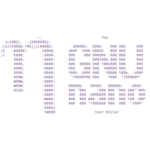
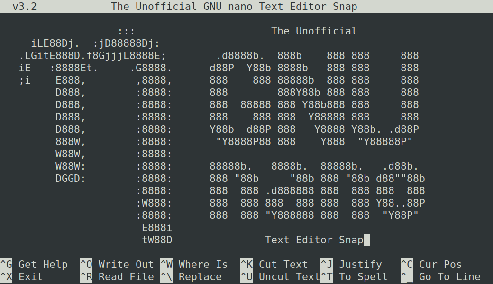

# Unofficial Snap Packaging for GNU Nano
<!--
​	Use the Staticaly service for easy access to in-repo pictures:
​	https://www.staticaly.com/
-->

**This is the unofficial snap for GNU Nano**, *"Single-line elevator pitch for your amazing snap"*. It works on Ubuntu, Fedora, Debian, and other major Linux distributions.

<!-- Uncomment and modify this when you are provided a build status badge

-->

Published for  with 💝 by Snapcrafters

<!-- Uncomment and modify this when you have published the snap to the Snap Store
## Installation
([Don't have snapd installed?](https://snapcraft.io/docs/core/install))

### In Terminal
    # Install Snap #
    sudo snap install --channel=edge --devmode nano
    #sudo snap install --channel=beta nano
    #sudo snap install nano
    
    # Connect the Snap to Required Interfaces #
    ## _plug_name_: Reasoning of connecting _plug_name_ ##
    sudo snap connect nano:_plug_name_
    
    # Connect the Snap to Optional Interfaces #
    ## _plug_name_: Reasoning of connecting _plug_name_ ##
    sudo snap connect nano:_plug_name_

### The Graphical Way

-->

<!-- Uncomment when you have test results
## What is Working
* [A list of functionallities that are verified working]

## What is NOT Working...yet 
Check out the [issue tracker](https://github.com/Lin-Buo-Ren/nano-snap/issues) for known issues.

## What is NOT Tested...yet
Anything not listed in "What is Working" and "What is NOT Working...yet" sections.
-->

<!-- Uncomment when you have initialized the URLs
## Support
* Report issues regarding using this snap to the issue tracker:  
  <https://github.com/Lin-Buo-Ren/nano-snap/issues>
* You may also post on the Snapcraft Forum, under the `snap` topic category:  
  <https://forum.snapcraft.io/c/snap>
-->
